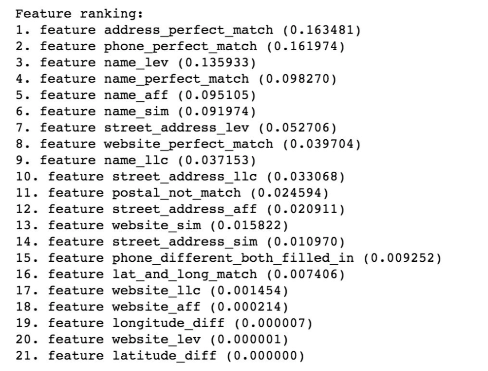

# Entity Resolution Technique:

To solve this problem, we started with simple data cleaning. For both ‘Foursquare’ and ‘Locu’ datasets, we compared and contrasted each feature to make sure that the format aligns for the best possible matching in the proceeding steps. The feature cleaning included:

1. Overall - first step of data cleaning was to make sure to substitute all empty cells and “None”s with numpy NaN to make sure that the equality would not hold between those feature cells.
2. Phone - align the format of foursquare to the format of locu. Get rid of parentheses and dashes
3. Website - only take out the domain name (capitalized). We dropped all the preceding strings like “http”, “www” etc. In addition, we got rid of everything that followed “.com” to only filter out the domain of the website. We recognized that this would increase the possibility of matching chain restaurants like Starbucks or Dunkin Donuts. Nonetheless, when testing for impact, it ended up being small
4. Name, Street Address - We capitalized and merged all words for name and Street Address. In addition, we also dropped all “s”, dashes, and other signs. Within Street Address Feature, we split by comma and #, to drop all suite numbers and state (in some addresses where was city and state included)
5. Country, State - recognized as non-unique features, country and state were dropped from the analysis

Next, we created a number of different new features based on the current feature list. New features included:
        
1. Perfect phone match
2. Phone mismatched while feature cell populated
3. Difference between latitudes in the two datasets
4. Difference between longitudes in the two datasets
5. Perfect match for latitude and longitude
6. Length of the most common string for name, website, and street address
7. Levenshtein distance for name, website, and street address
8. Affine gap between the names, websites, and street addresses

Then, we created a dataframe of all possible combinations with the new features and ran Random Forest algorithm from scikit learn to output the prediction confidence. We knowingly chose to still build a full dataframe (not to avoid pairwise comparison) in pursuit of a better F1 score. Since the Random Forest algorithm running time on the entire dataframe was not too long, this seemed like a rational decision.

Based on the outcome of the random forest, we then filtered for matches with score above 0.3. We originally chose 0.5. Nonetheless, after experimenting with the threshold, 0.3 ended up giving us the best compromise between precision and accuracy.

Lastly, we made sure to check for any double pairing in the final output. Nonetheless, in our practice, there was no double matching within the train set once the threshold of 0.3 was established.

The described above approach allowed us to achieve relatively good results with the following parameters on the train data:
1. Precision: **98.8**
2. Recall: **99.7**
3. F1 score: **99.3**

### Final Test Score - 96.8

## Avoiding Pairwise Comparison

We tested a number of different approaches for reducing pairwise comparison including filtering out all the pairs that have a difference between latitude and longitude more than 0.06, assuming perfect match for pairs when coordinates do match and filtering out all the other pairs associated with those ids, as well as filtering out the perfect matching when the phone number aligns. Nonetheless, after comparing the scores for different models, we consciously decided not to avoid pairwise comparison in the effort to achieve a better score through a random forest model. In the future, if we had to avoid the comparison with a much bigger dataset, we would use perfect phone number matching as a way to to filter out those pairs and significantly decrease the final dataframe size.

## Feature Importance
Below is a table of the top features testes and their corresponding coefficients.

